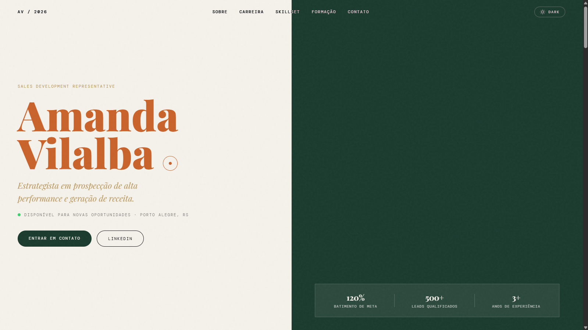
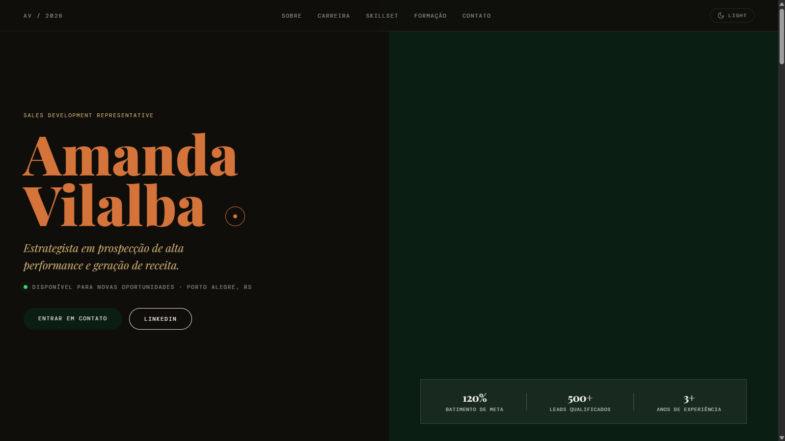
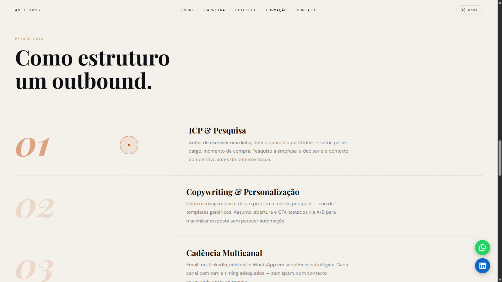
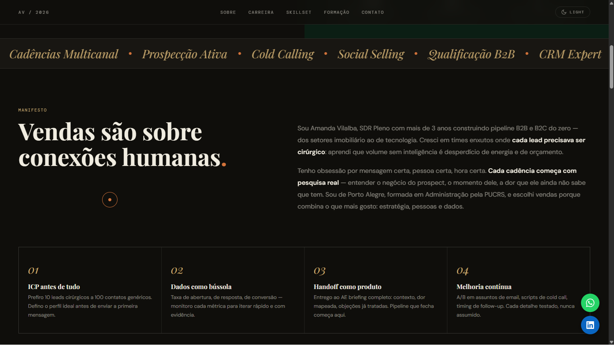
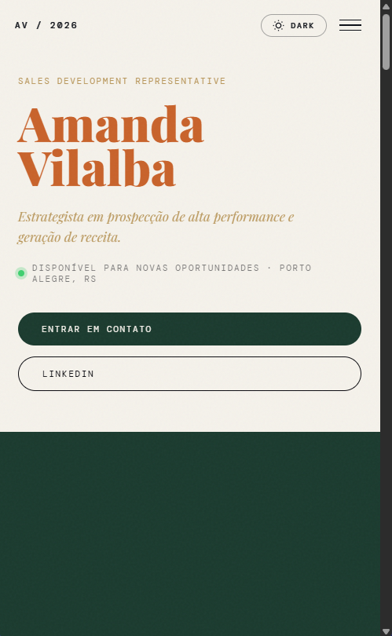

# Amanda Vilalba — Portfólio Profissional

Site de portfólio pessoal desenvolvido para **Amanda Vilalba**, SDR Pleno especialista em prospecção B2B/B2C, qualificação de leads e CRM. Projeto construído com HTML, CSS e JavaScript puros — sem frameworks, sem dependências de build.

🔗 **[amandavilalba.com](https://amandavilalba.com)**

---

## Visão Geral

Landing page de portfólio com foco em performance, acessibilidade e SEO. O design editorial combina tipografia serifada com uma paleta quente, suporte a dark/light mode e animações suaves baseadas em Intersection Observer — tudo sem uma linha de framework JS.

---

## Screenshots

### Hero — Light Mode


### Hero — Dark Mode


### Seções — Sobre, Pilares e Habilidades


### Experiência Profissional e Resultados


### Responsivo — Mobile


---

## Funcionalidades

- **Dark / Light Mode** com persistência via `localStorage` e detecção automática por `prefers-color-scheme`
- **Cursor customizado** para desktop com animação de lag suave via `requestAnimationFrame`
- **Animações de entrada** na hero em cascata com `hero-loaded` class
- **Count-up animado** nos cards de resultado, disparado pelo Intersection Observer
- **Skill bars animadas** com porcentagem preenchida ao entrar na viewport
- **Carrossel de depoimentos** com suporte a swipe touch, navegação por teclado e autoplay com pausa no hover
- **Marquee infinito** de palavras-chave com CSS puro
- **Scroll reveal** em cascata para os elementos das seções
- **Floating CTAs** (WhatsApp + LinkedIn) que aparecem após o scroll da hero
- **Smooth scroll** para âncoras internas com offset do nav fixo
- **Menu mobile** com overlay, bloqueio de scroll e fechamento por `Escape`
- **Proteção de e-mail** contra scrapers: o endereço é montado em partes via JavaScript, nunca exposto em texto puro no HTML
- **Back to top** com scroll suave

---

## Stack

| Camada | Tecnologia |
|---|---|
| Marcação | HTML5 semântico |
| Estilo | CSS3 (custom properties, grid, flexbox, animações) |
| Comportamento | JavaScript ES6+ vanilla (`'use strict'`) |
| Tipografia | Google Fonts — Playfair Display, DM Sans, DM Mono |
| Ícones | SVGs inline |
| Deploy | Qualquer servidor estático (Apache, Nginx, Vercel, Netlify) |

---

## Estrutura do Projeto

```
📁 /
├── index.html          # Estrutura e conteúdo da página
├── style.css           # Todos os estilos (tokens, componentes, responsivo)
├── script.js           # Toda a lógica de interação
├── sitemap.xml         # Sitemap para indexação no Google
├── robots.txt          # Instruções para crawlers
├── .htaccess           # Headers de segurança e otimizações (Apache)
├── SECURITY.md         # Guia de headers para Vercel, Netlify e Nginx
└── assets/
    └── img/
        ├── FotoProfissionalSDR.png   # Foto principal (hero)
        └── og-cover.jpg              # Imagem de preview para redes sociais
```

---

## SEO

O projeto implementa uma estratégia completa de SEO on-page:

- `<title>` e `<meta name="description">` otimizados com palavras-chave de nicho
- `<meta name="keywords">` com termos como _vaga SDR Porto Alegre_, _SDR remoto_, _cold email_, _cadência multicanal_
- **Schema.org** do tipo `Person` com `knowsAbout`, `alumniOf`, `address` e `sameAs`
- **Open Graph** e **Twitter Card** para preview em redes sociais
- `<link rel="canonical">` para evitar conteúdo duplicado
- `sitemap.xml` para facilitar a descoberta pelo Googlebot
- `robots.txt` apontando para o sitemap
- Linha comentada no `<head>` para verificação do **Google Search Console**

---

## Segurança

Todas as proteções foram aplicadas em camadas — meta tags no HTML, `.htaccess` no servidor e guia para outros ambientes em `SECURITY.md`.

| Proteção | Implementação |
|---|---|
| Clickjacking | `X-Frame-Options: DENY` |
| MIME sniffing | `X-Content-Type-Options: nosniff` |
| Referrer leaking | `Referrer-Policy: strict-origin-when-cross-origin` |
| Permissões do browser | `Permissions-Policy: camera=(), microphone=(), geolocation=()` |
| HTTPS forçado | `Strict-Transport-Security` (HSTS, 1 ano) |
| Injeção de scripts | `Content-Security-Policy` restritivo |
| Scraping de e-mail | Endereço montado em partes via JS, nunca em texto puro no HTML |
| Cache de assets | `mod_expires` configurado no `.htaccess` |
| Compressão | GZIP via `mod_deflate` |

Para usar em ambientes que não sejam Apache (Vercel, Netlify, Nginx, Cloudflare), consulte o [`SECURITY.md`](./SECURITY.md).

---

## Como Usar Localmente

Não requer instalação, build ou dependências. Basta clonar e abrir:

```bash
git clone https://github.com/mauricionrdev/amanda-vilalba-portfolio.git
cd amanda-vilalba-portfolio
```

Abra o `index.html` diretamente no browser, ou use um servidor local para evitar restrições de CORS com os assets:

```bash
# Python
python3 -m http.server 3000

# Node.js (npx)
npx serve .
```

Acesse `http://localhost:3000`.

---

## Deploy

O projeto é estático e pode ser hospedado em qualquer plataforma:

**Vercel**
```bash
npx vercel --prod
```

**Netlify** — arraste a pasta para o painel ou conecte ao repositório GitHub.

**Apache/cPanel** — envie todos os arquivos via FTP para o `public_html`. O `.htaccess` já está configurado.

> Após o deploy, registre o domínio no [Google Search Console](https://search.google.com/search-console) e cole o código de verificação na linha comentada no `<head>` do `index.html`.

---

## Performance e Checklist Pós-Deploy

- [ ] Testar Core Web Vitals: [pagespeed.web.dev](https://pagespeed.web.dev)
- [ ] Verificar headers de segurança: [securityheaders.com](https://securityheaders.com)
- [ ] Validar preview de redes sociais: [opengraph.xyz](https://www.opengraph.xyz)
- [ ] Registrar no Google Search Console e adicionar o código de verificação
- [ ] Confirmar que `assets/img/og-cover.jpg` existe no servidor (usada no preview de compartilhamento)

---

## Desenvolvido por

**Mauricio Nunes** — [github.com/mauricionrdev](https://github.com/mauricionrdev) · [linkedin.com/in/mauricionrdev](https://www.linkedin.com/in/mauricionrdev/)

---

## Licença

Este projeto foi desenvolvido sob demanda. O código é de uso livre para fins de estudo e referência. O conteúdo (textos, foto, marca pessoal) pertence exclusivamente a **Amanda Vilalba**.
